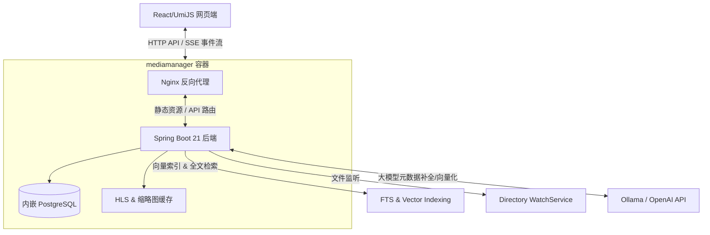

# MediaManager (v0.0.1)

自托管的现代化媒体管理平台，覆盖媒体库扫描、元数据刮削、分类标签、在线播放、AI 辅助和系统管理。

## 系统架构与数据流

本系统通过前后台分离架构运行，后端基于 Spring Boot 3.x 采用虚拟线程（Virtual Threads）以提升高并发性能。



## v0.0.1 主要特性

1. **安全与隔离加固**:
   - **HttpOnly Cookie 认证**: 引入短期流媒体 token 机制，使用安全的 HttpOnly `mm_stream_token` cookie 进行 SSE 连通性校验和流媒体数据传输，防范 JWT 通过 URL 查询参数泄漏。
   - **ReDoS 超时防护**: 针对自定义分类规则匹配，内置了正则超时匹配器，运行在独立的虚拟线程中，最长超时 500ms，防范正则拒绝服务攻击。
   - **强密码策略**: 自带 `PasswordValidator` 校验规则，保证用户账号强度。
   
2. **Phase 3 后端功能完善**:
   - **扫描进度与可取消机制**: `LibraryScanService` 引入并注册了全局 `cancelledScans`，用户可以在 `/api/v1/system/scan/{libraryId}/cancel` 端点一键取消正在运行的媒体库扫描任务。
   - **孤儿 HLS 段自动清理**: 内置定时任务 `HlsCacheCleanupJob`，每小时清理超过 2 小时的临时 `.ts` 视频流段。
   - **外部 API 智能限流**: TMDb 查询内置信号量限流器（3 并发并发极值限制），防范请求过频被官方拉黑。
   - **语义检索优化与分页**: 语义相似度搜索阈值稳定在 `0.6f` 以上，支持对向量搜索候选集进行完美的分页和去重处理。
   - **多线程 WatchService 增强**: 替换了原有单线程的文件监听，升级为双线程执行器，并且当捕获 `OVERFLOW` 溢出事件时，自动触发针对受影响目录的完整重新扫描。
   - **原子级事务增强**: 全局所有涉及状态变更的数据处理操作（如 `ScrapeTaskService` 批量刮削子任务等）使用 `transactionTemplate` 做精细化的事务隔离封装，防范数据库并发死锁。

旧版 `docs/01-09` 仅作历史参考。

## 快速启动

适用于 Windows + Docker Desktop。

1. 准备环境变量：

```powershell
$env:JWT_SECRET="change-me-in-production-256-bit-key"
$env:POSTGRES_PASSWORD="change-me-in-production"
$env:HOST_MEDIA_PATH="E:\Movies"
```

2. 启动服务：

```powershell
docker-compose up --build -d
```

3. 访问：

- Web: [http://localhost/](http://localhost/)
- 健康检查: [http://localhost/api/v1/system/status](http://localhost/api/v1/system/status)

4. 查看日志：

```powershell
docker-compose logs -f
```

## 关键配置

| 变量 | 说明 | 默认值 |
| --- | --- | --- |
| `JWT_SECRET` | JWT 签名密钥，生产环境必须修改 | `change-me...` |
| `POSTGRES_PASSWORD` | 内嵌 PostgreSQL 密码（生产环境必须修改） | `mediamanager` |
| `HOST_MEDIA_PATH` | 宿主机媒体目录 | `./media` |
| `MEDIAMANAGER_STORAGE_PATH_MAP_FROM` | 数据库中保存的旧路径前缀 | 同 `HOST_MEDIA_PATH` |
| `MEDIAMANAGER_STORAGE_PATH_MAP_TO` | 容器内映射路径 | `/home/media` |

容器内会将 `HOST_MEDIA_PATH` 映射到 `/home/media`，用于兼容数据库里已经保存的 Windows 绝对路径，避免播放时出现 `40404 Media file not found`。

PostgreSQL 数据持久化在 `./data/postgres`（通过 `./data` 卷挂载），与缩略图/HLS 缓存共用 `./data` 目录。

## 功能入口

- 首次启动进入 `/setup` 创建管理员账号，之后通过 `/login` 登录。
- 媒体库在 `/libraries` 创建和扫描。
- 媒体浏览在 `/browse`，搜索在 `/search`，发现页在 `/discover`。
- 系统、AI、媒体处理、用户、日志、任务和插件配置统一进入 `/settings`。

## 本地开发

前端：

```powershell
cd media-manager-web
npm install
npm run dev
```

后端：

```powershell
cd media-manager-server
mvn spring-boot:run
```

如果使用 Docker 运行后端，同时在宿主机运行 Ollama，请在设置页将 Ollama 地址配置为 `http://host.docker.internal:11434`。
