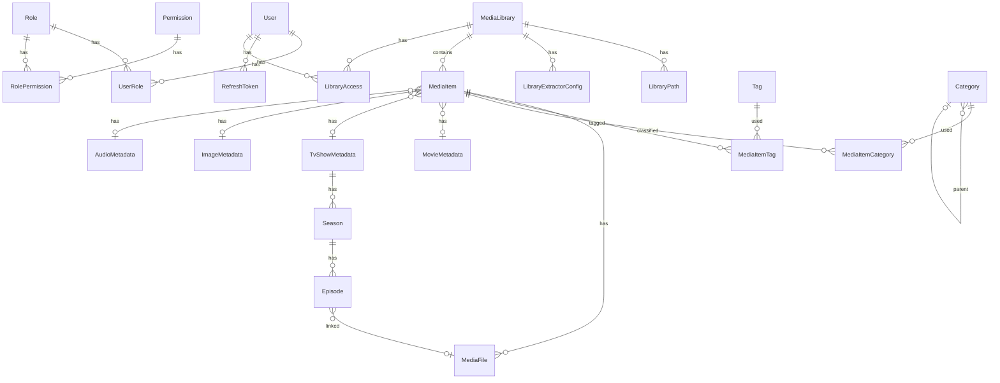

# MediaManager — 数据库设计

## 1. ER 关系图

## 2. 用户与权限表

### sys_user
| 字段 | 类型 | 说明 |
|------|------|------|
| id | BIGSERIAL PK | |
| username | VARCHAR(64) UNIQUE NOT NULL | 用户名 |
| password_hash | VARCHAR(255) NOT NULL | BCrypt 加密密码 |
| display_name | VARCHAR(128) | 显示名 |
| email | VARCHAR(255) | 邮箱 |
| avatar_path | VARCHAR(512) | 头像路径 |
| enabled | BOOLEAN DEFAULT true | 是否启用 |
| created_at | TIMESTAMP | |
| updated_at | TIMESTAMP | |

### sys_role
| 字段 | 类型 | 说明 |
|------|------|------|
| id | BIGSERIAL PK | |
| code | VARCHAR(32) UNIQUE NOT NULL | 角色标识: SUPER_ADMIN, ADMIN, USER, GUEST |
| name | VARCHAR(64) NOT NULL | 显示名 |
| description | TEXT | 描述 |
| built_in | BOOLEAN DEFAULT false | 是否内置角色(不可删除) |
| created_at | TIMESTAMP | |

### sys_permission
| 字段 | 类型 | 说明 |
|------|------|------|
| id | BIGSERIAL PK | |
| code | VARCHAR(64) UNIQUE NOT NULL | 如 `media:delete_file` |
| name | VARCHAR(128) NOT NULL | 显示名 |
| group_name | VARCHAR(32) | 权限分组: system, user, library, media, tag, category, task |

### sys_user_role / sys_role_permission
标准多对多关联表 (user_id + role_id / role_id + permission_id)。

### sys_refresh_token
| 字段 | 类型 | 说明 |
|------|------|------|
| id | BIGSERIAL PK | |
| user_id | BIGINT FK | |
| token | VARCHAR(512) UNIQUE | Refresh Token |
| expires_at | TIMESTAMP | 过期时间 |
| revoked | BOOLEAN DEFAULT false | 是否已撤销 |
| created_at | TIMESTAMP | |

### library_access
| 字段 | 类型 | 说明 |
|------|------|------|
| id | BIGSERIAL PK | |
| user_id | BIGINT FK | |
| library_id | BIGINT FK | |
| can_view | BOOLEAN DEFAULT true | |
| can_edit | BOOLEAN DEFAULT false | |
| can_delete_file | BOOLEAN DEFAULT false | |

## 3. 媒体库表

### media_library
| 字段 | 类型 | 说明 |
|------|------|------|
| id | BIGSERIAL PK | |
| name | VARCHAR(128) NOT NULL | 媒体库名称 |
| type | VARCHAR(16) NOT NULL | MOVIE / TV_SHOW / IMAGE / AUDIO / MIXED |
| language | VARCHAR(8) DEFAULT 'zh' | 首选语言 |
| auto_scan | BOOLEAN DEFAULT true | 启用自动扫描 |
| scan_interval_minutes | INT DEFAULT 30 | 扫描间隔 |
| created_at / updated_at | TIMESTAMP | |

### library_path
| 字段 | 类型 | 说明 |
|------|------|------|
| id | BIGSERIAL PK | |
| library_id | BIGINT FK | |
| path | VARCHAR(1024) NOT NULL | 目录绝对路径 |
| priority | INT DEFAULT 0 | 优先级 |

### library_extractor_config
| 字段 | 类型 | 说明 |
|------|------|------|
| id | BIGSERIAL PK | |
| library_id | BIGINT FK | |
| extractor_type | VARCHAR(32) NOT NULL | NFO / FFPROBE / TMDB / EXIF / MUSICBRAINZ |
| priority | INT DEFAULT 0 | 执行优先级(越小越先) |
| enabled | BOOLEAN DEFAULT true | |
| config | JSONB | 提取器特定配置 |

## 4. 媒体项表

### media_item
| 字段 | 类型 | 说明 |
|------|------|------|
| id | BIGSERIAL PK | |
| library_id | BIGINT FK | |
| title | VARCHAR(512) | 标题 |
| original_title | VARCHAR(512) | 原始标题 |
| sort_title | VARCHAR(512) | 排序标题 |
| type | VARCHAR(16) NOT NULL | MOVIE / TV_SHOW / EPISODE / IMAGE / AUDIO |
| status | VARCHAR(16) DEFAULT 'UNIDENTIFIED' | IDENTIFIED / UNIDENTIFIED / ERROR |
| release_date | DATE | 发行日期 |
| rating | DECIMAL(3,1) | 评分 |
| overview | TEXT | 简介 |
| poster_path | VARCHAR(1024) | 海报缓存路径 |
| backdrop_path | VARCHAR(1024) | 背景图路径 |
| provider_ids | JSONB / TEXT | `{"tmdb": "123", "imdb": "tt123"}`（SQLite 中为 TEXT） |
| custom_fields | JSONB / TEXT | 扩展字段（SQLite 中为 TEXT） |
| created_at / updated_at / last_scanned_at | TIMESTAMP | |

**索引**: `(library_id, type, status)`, `(type, release_date)`, GIN on `provider_ids`

### media_file
| 字段 | 类型 | 说明 |
|------|------|------|
| id | BIGSERIAL PK | |
| media_item_id | BIGINT FK | |
| file_path | VARCHAR(2048) NOT NULL | 完整路径 |
| file_name | VARCHAR(512) | 文件名 |
| file_size | BIGINT | 字节 |
| mime_type | VARCHAR(128) | |
| container | VARCHAR(16) | mkv / mp4 / avi |
| video_codec | VARCHAR(32) | H.264 / HEVC / AV1 |
| audio_codec | VARCHAR(32) | AAC / FLAC |
| width | INT | |
| height | INT | |
| duration_seconds | INT | |
| bitrate | INT | |
| checksum_sha256 | VARCHAR(64) | 用于变更检测 |
| file_modified_at | TIMESTAMP | 文件修改时间 |
| deleted | BOOLEAN DEFAULT false | 软删除标记 |
| deleted_at | TIMESTAMP | 删除时间(回收站30天) |
| created_at | TIMESTAMP | |

**索引**: `UNIQUE(file_path)`, `(media_item_id)`

## 5. 类型专属元数据表

### movie_metadata
| 字段 | 类型 | 说明 |
|------|------|------|
| id | BIGSERIAL PK | |
| media_item_id | BIGINT FK UNIQUE | |
| tagline | VARCHAR(512) | |
| runtime_minutes | INT | |
| certification | VARCHAR(16) | PG-13 等 |
| genres | JSONB / TEXT | `["Action", "Sci-Fi"]`（SQLite 中为 TEXT） |
| studios | JSONB / TEXT | （SQLite 中为 TEXT） |
| cast_info | JSONB / TEXT | `[{"name":"...", "role":"...", "thumb":"..."}]`（字段名为 `cast_info`） |
| crew | JSONB / TEXT | （SQLite 中为 TEXT） |
| trailer_url | VARCHAR(1024) | |

### tv_show_metadata / season / episode
TV 剧集三级结构，与 Jellyfin tvshow.nfo + season.nfo + episode.nfo 对应。

### image_metadata
| 字段 | 类型 | 说明 |
|------|------|------|
| id | BIGSERIAL PK | |
| media_item_id | BIGINT FK UNIQUE | |
| width / height | INT | |
| camera_make / camera_model / lens | VARCHAR(128) | |
| iso / aperture / shutter_speed | VARCHAR(32) | |
| taken_at | TIMESTAMP | 拍摄时间 |
| gps_latitude / gps_longitude | DOUBLE | |
| exif_data | JSONB | 完整 EXIF |

### audio_metadata
| 字段 | 类型 | 说明 |
|------|------|------|
| id | BIGSERIAL PK | |
| media_item_id | BIGINT FK UNIQUE | |
| artist | VARCHAR(256) | |
| album | VARCHAR(256) | |
| album_artist | VARCHAR(256) | |
| track_number | INT | |
| disc_number | INT | |
| genres | JSONB / TEXT | |
| duration_seconds | INT | |
| bitrate | INT | |
| sample_rate | INT | |
| channels | INT | |

## 6. 分类与标签

### tag
| 字段 | 类型 | 说明 |
|------|------|------|
| id | BIGSERIAL PK | |
| name | VARCHAR(64) UNIQUE NOT NULL | |
| color | VARCHAR(7) | HEX 颜色 |
| source | VARCHAR(16) DEFAULT 'MANUAL' | MANUAL / AUTO / RULE |
| created_at | TIMESTAMP | |

### category
| 字段 | 类型 | 说明 |
|------|------|------|
| id | BIGSERIAL PK | |
| name | VARCHAR(128) NOT NULL | |
| parent_id | BIGINT FK (self) | 树形结构 |
| type | VARCHAR(16) NOT NULL | GENRE / YEAR / RESOLUTION / CODEC / CUSTOM |
| created_at | TIMESTAMP | |

### media_item_tag / media_item_category
多对多关联表。

## 7. 系统配置表

### sys_config
| 字段 | 类型 | 说明 |
|------|------|------|
| id | BIGSERIAL PK | |
| config_key | VARCHAR(128) UNIQUE NOT NULL | |
| config_value | TEXT | |
| description | VARCHAR(256) | |

## 8. Flyway 迁移策略

| 版本 | 文件 | 内容 |
|------|------|------|
| V1 | `V1__init_schema.sql` | 所有表结构创建 |
| V2 | `V2__init_permissions.sql` | 插入 18 个预置权限 |
| V3 | `V3__init_roles.sql` | 插入 4 个预置角色 + 角色权限关联 |
| V4 | `V4__init_config.sql` | 系统初始配置项 (auth.enabled, ffmpeg.path 等) |
| V5 | `V5__init_categories.sql` | 预置分类维度 (年份/分辨率/编码等) |

首次启动时，通过应用启动逻辑检测是否存在 SUPER_ADMIN 用户，若不存在则进入初始化向导。
