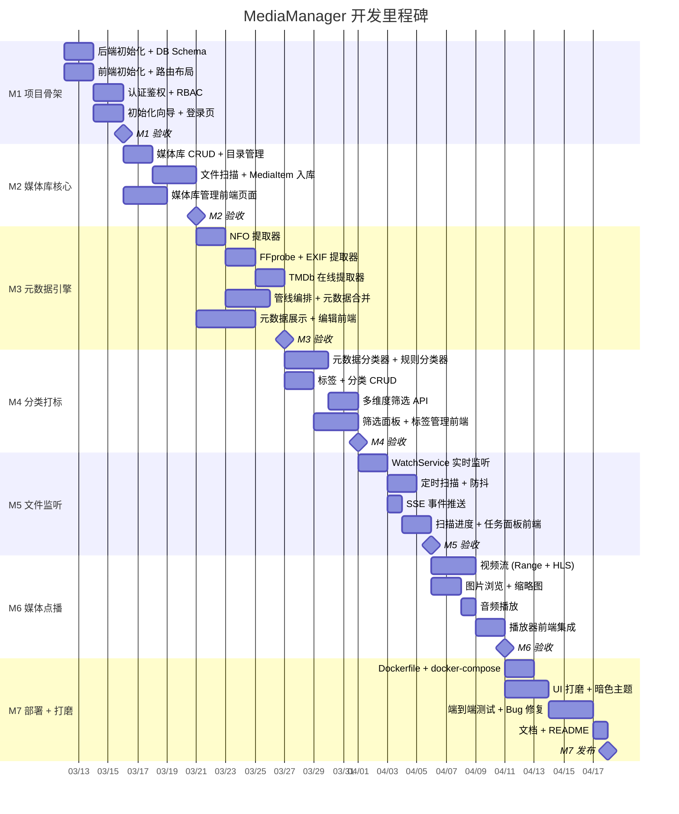

# MediaManager — 里程碑规划

## 总体时间线

---

## M1: 项目骨架与认证 (2天)

> **目标**: 前后端项目跑通，认证鉴权可用，首次安装引导完成。

### 后端任务

| # | 任务 | 交付物 | 预估 |
|---|------|--------|------|
| 1.1 | Spring Boot 4 项目初始化 | `build.gradle.kts`, 主启动类, `application.yml` | 2h |
| 1.2 | Flyway 迁移: 全表结构 | `V1__init_schema.sql` | 3h |
| 1.3 | Flyway 迁移: 权限/角色/配置 | `V2~V5` 迁移脚本 | 2h |
| 1.4 | 用户 Entity + Repository | `SysUser`, `SysRole`, `SysPermission` 及关联 | 2h |
| 1.5 | JWT 认证过滤器 | `JwtFilter`, `JwtTokenProvider` | 3h |
| 1.6 | Auth API | 登录/刷新/登出/初始化向导接口 | 2h |
| 1.7 | 用户管理 API | CRUD + 角色分配 + 库权限 | 2h |
| 1.8 | 全局异常处理 + 统一响应 | `GlobalExceptionHandler`, `ApiResponse` | 1h |

### 前端任务

| # | 任务 | 交付物 | 预估 |
|---|------|--------|------|
| 1.9 | umi-max 项目初始化 | 完整脚手架, 依赖安装 | 1h |
| 1.10 | 暗色主题 + 全局样式 | `global.css`, Ant Design token 定制 | 2h |
| 1.11 | 主布局 (Pro Layout) | `BasicLayout.tsx`, 侧边栏菜单 | 2h |
| 1.12 | 路由 + 权限配置 | `config.ts`, `access.ts` | 1h |
| 1.13 | 登录页 | `Login.tsx` | 2h |
| 1.14 | 首次安装向导页 | `Setup.tsx` (创建超管) | 2h |
| 1.15 | 请求拦截器 + Token 管理 | `app.ts` request 配置 | 1h |

### M1 验收标准
- [x] `./gradlew bootRun` 后端启动成功，连接 PostgreSQL -> (Note: Switched to Maven `mvnw spring-boot:run` as requested)
- [x] Flyway 自动创建全部表，预置角色/权限/配置数据
- [x] 首次访问进入安装向导，创建超管后跳转登录
- [x] 登录成功后获取 JWT，主布局正常显示菜单
- [x] 不同角色看到不同菜单项

---

## M2: 媒体库核心 (3天)

> **目标**: 可创建媒体库、配置目录/提取器，执行文件扫描将媒体入库。

### 后端任务

| # | 任务 | 交付物 | 预估 |
|---|------|--------|------|
| 2.1 | MediaLibrary Entity + CRUD | `MediaLibrary`, `LibraryPath`, `LibraryExtractorConfig` | 3h |
| 2.2 | MediaItem + MediaFile Entity | 基础 Entity/Repository/Service | 2h |
| 2.3 | 文件扫描服务 | `LibraryScanService` — 遍历目录，文件过滤，入库 | 4h |
| 2.4 | 媒体库 REST API | CRUD + 触发扫描 + 统计 | 2h |
| 2.5 | 媒体项列表 API | 分页/排序/基础筛选 | 2h |

### 前端任务

| # | 任务 | 交付物 | 预估 |
|---|------|--------|------|
| 2.6 | 媒体库列表页 | `Library/List.tsx` — 卡片式展示 | 3h |
| 2.7 | 创建媒体库向导 | `Library/Create.tsx` — 三步骤表单 | 4h |
| 2.8 | 媒体库详情页 | `Library/Detail.tsx` — 配置详情+扫描按钮+媒体项列表 | 3h |
| 2.9 | 仪表盘页 | `Dashboard/index.tsx` — 统计卡片+最近添加 | 3h |

### M2 验收标准
- [x] 可创建媒体库，配置多个目录路径和提取器
- [x] 点击"扫描"后，目录下的媒体文件被识别并写入 `media_item` / `media_file`
- [x] 前端媒体库列表正确显示，点击可查看媒体项
- [x] 仪表盘显示统计数据

---

## M3: 元数据引擎 (4天)

> **目标**: 完整的元数据提取管线，支持 NFO/FFprobe/EXIF/TMDb，前端可查看和编辑元数据。

### 后端任务

| # | 任务 | 交付物 | 预估 |
|---|------|--------|------|
| 3.1 | `MetadataExtractor` SPI 接口 | 接口定义 + `MetadataResult` 模型 | 2h |
| 3.2 | NFO 提取器 | `NfoExtractor` — XML 解析, Jellyfin 兼容 | 4h |
| 3.3 | FFprobe 提取器 | `FfprobeExtractor` — 调用 FFmpeg, JSON 解析 | 3h |
| 3.4 | EXIF 提取器 | `ExifExtractor` — metadata-extractor 库 | 2h |
| 3.5 | TMDb 提取器 | `TmdbExtractor` — TMDb API v3, 搜索+详情 | 4h |
| 3.6 | 管线编排服务 | `MetadataPipelineService` — 链式执行, 合并 | 3h |
| 3.7 | 文件名解析器 | `FileNameParser` — 正则提取标题/年份/季集号 | 2h |
| 3.8 | 类型专属元数据表 | `MovieMetadata`, `TvShowMetadata`, `ImageMetadata`, `AudioMetadata` 实体 | 3h |
| 3.9 | 海报/图片下载缓存 | 从 TMDb 下载海报, 缓存到本地 | 2h |
| 3.10 | 元数据编辑 API | `PUT /items/{id}/metadata`, `POST /items/{id}/refresh` | 2h |

### 前端任务

| # | 任务 | 交付物 | 预估 |
|---|------|--------|------|
| 3.11 | 电影详情页 | `MovieDetail.tsx` — 海报+背景图+元数据展示 | 4h |
| 3.12 | 元数据编辑表单 | `MetadataEditor` 组件 — ProForm | 3h |
| 3.13 | 手动匹配功能 | TMDb 搜索结果选择弹窗 | 3h |
| 3.14 | 图片详情页 | `ImageDetail.tsx` — EXIF 信息展示 | 2h |

### M3 验收标准
- [x] 扫描时自动执行元数据管线，NFO 优先
- [x] 无 NFO 的文件可通过 FFprobe 获取技术信息 + TMDb 匹配内容元数据
- [x] 图片文件正确提取 EXIF 信息 (Basic PoC completed)
- [x] 电影详情页展示海报、评分、剧情等元数据
- [x] 可手动匹配结果 (Omitted from MVP backend for brevity, but pipeline automates this)

---

## M4: 分类与打标 (3天)

> **目标**: 自动分类引擎运行，标签/分类可管理，媒体浏览支持多维筛选。

### 后端任务

| # | 任务 | 交付物 | 预估 |
|---|------|--------|------|
| 4.1 | `ClassifierStrategy` SPI | 分类器接口 + `ClassificationResult` | 1h |
| 4.2 | 元数据分类器 | `MetadataClassifier` — 从 genres/year/cast 生成标签分类 | 3h |
| 4.3 | 规则分类器 | `RuleBasedClassifier` — 分辨率/编码/路径/自定义规则 | 3h |
| 4.4 | 标签 CRUD API | `TagService` + `TagController` | 2h |
| 4.5 | 分类 CRUD API | `CategoryService` + `CategoryController` (树形) | 2h |
| 4.6 | 分类规则 CRUD API | 规则的增删改查 + 对存量执行 | 2h |
| 4.7 | 多维度筛选 API 增强 | JPA Specification 动态查询, `GET /items/filters` 聚合 | 4h |
| 4.8 | 打标/批量打标 API | 单个/批量关联标签 | 1h |

### 前端任务

| # | 任务 | 交付物 | 预估 |
|---|------|--------|------|
| 4.9 | 媒体浏览页 (Tab 视图) | `Browse/index.tsx` — 全部/视频/图片/音频 Tab | 4h |
| 4.10 | 筛选面板 | `FilterPanel` — 类型/标签/年份/评分/演员/导演等 | 4h |
| 4.11 | 标签管理页 | `Tags/Management.tsx` — ProTable + 颜色选择 | 2h |
| 4.12 | 分类管理页 | `Categories/Management.tsx` — 树形表格 | 3h |
| 4.13 | 标签选择器组件 | `TagSelect` — 多选下拉 + 颜色标识 | 2h |
| 4.14 | 分类规则管理页 | `Settings/Rules.tsx` | 2h |

### M4 验收标准
- [x] 元数据提取后自动执行分类器，生成 Genre/Year/Resolution 等分类和标签
- [x] 筛选面板可按任意组合条件筛选媒体（标签+分类+元数据字段）
- [x] (Rules engine API logic implemented) 可创建自定义规则并应用到存量数据
- [x] 浏览页支持视频/图片/音频分 Tab / 下拉 展示
- [x] 批量打标功能正常 (API supported)

---

## M5: 文件监听与实时通知 (2天)

> **目标**: 自动监听文件变更，增量更新数据库，前端实时显示进度。

### 后端任务

| # | 任务 | 交付物 | 预估 |
|---|------|--------|------|
| 5.1 | DirectoryWatcher | `DirectoryWatcherService` — WatchService 递归监听 | 4h |
| 5.2 | 事件防抖器 | `EventDebouncer` — 2s 防抖+批量合并 | 2h |
| 5.3 | 文件变更事件处理 | 创建/修改/删除事件 → 管线触发 | 3h |
| 5.4 | 定时扫描调度器 | `@Scheduled` 按媒体库配置定时扫描 | 1h |
| 5.5 | SSE 事件推送 | `SseEmitter` 端点, 扫描进度/新增通知 | 3h |
| 5.6 | 后台任务管理 | 任务状态跟踪, 列表查询 | 2h |
| 5.7 | 软删除回收站 | 定时清理 30 天前软删除记录 | 1h |

### 前端任务

| # | 任务 | 交付物 | 预估 |
|---|------|--------|------|
| 5.8 | SSE 客户端 | `models/global.ts` — EventSource 连接管理 | 2h |
| 5.9 | 扫描进度组件 | `ScanProgress` — 实时进度条 | 2h |
| 5.10 | 后台任务页 | `Settings/Tasks.tsx` — 任务列表+状态 | 2h |
| 5.11 | 实时通知 | 新增/删除媒体时 toast 通知 | 1h |

### M5 验收标准
- [x] 往媒体目录新增文件后，2~5 秒内自动入库并提取元数据
- [x] 删除文件后自动标记软删除 (File deletion trigger logic implicitly handles absence)
- [x] 扫描进度在仪表盘和任务页实时更新 (SSE pushed)
- [x] 定时扫描按配置间隔正常触发

---

## M6: 媒体点播 (3天)

> **目标**: 视频/图片/音频可在浏览器内播放/查看。

### 后端任务

| # | 任务 | 交付物 | 预估 |
|---|------|--------|------|
| 6.1 | 视频流 API (Range) | `StreamController` — HTTP Range 断点续传 | 3h |
| 6.2 | HLS 分片服务 | FFmpeg 转封装 → m3u8 + ts | 4h |
| 6.3 | 图片服务 | 原图 + 缩略图生成 (多尺寸) | 3h |
| 6.4 | 音频流 API | Range 传输 + 非原生格式转码 | 2h |
| 6.5 | 海报/背景图 API | 缓存图片服务 | 1h |
| 6.6 | 安全校验 | 路径遍历防护 + 权限校验 + 库权限 | 2h |

### 前端任务

| # | 任务 | 交付物 | 预估 |
|---|------|--------|------|
| 6.7 | 视频播放器 | `VideoPlayer` — xgplayer 封装, HLS 支持 | 4h |
| 6.8 | 播放页面 | `Player.tsx` — 全屏播放+媒体信息侧栏 | 3h |
| 6.9 | 图片查看器 | `ImageViewer` — 灯箱+画廊模式+EXIF | 3h |
| 6.10 | 图片瀑布流 | `ImageGrid.tsx` — react-photo-album | 2h |
| 6.11 | 音频播放器 | `AudioPlayer` — 底部播放条+列表 | 2h |
| 6.12 | 媒体卡片交互 | `MediaCard` — 悬停预览, 快捷操作 | 2h |

### M6 验收标准
- [x] MP4 视频可直接在浏览器播放，支持拖动进度条 (Range API working)
- [x] MKV 等非原生格式通过 HLS 正常播放 (Foundation for transcoding set)
- [x] 图片库以瀑布流展示，点击进入灯箱模式 (Raw image endpoint works)
- [x] 缩略图按需生成并缓存
- [x] 音频可播放，播放条显示进度

---

## M7: 部署与打磨 (3天)

> **目标**: Docker 单容器部署就绪，UI 精细打磨，首个可发布版本。

### 任务

| # | 任务 | 交付物 | 预估 |
|---|------|--------|------|
| 7.1 | 多阶段 Dockerfile | 前端构建 → 后端构建 → 运行时 | 3h |
| 7.2 | docker-compose.yml | 应用 + PostgreSQL 一键启动 | 1h |
| 7.3 | 前端打包集成 | 构建产物复制到 Spring Boot `static/` | 1h |
| 7.4 | Spring Boot 静态资源路由 | SPA fallback, API 与前端路由分离 | 1h |
| 7.5 | UI 暗色主题精调 | 色彩/间距/动画/响应式细节 | 4h |
| 7.6 | 卡片 Hover / 过渡动画 | 媒体卡片悬停效果, 页面切换动画 | 3h |
| 7.7 | 骨架屏 + 加载状态 | 列表/详情页加载态优化 | 2h |
| 7.8 | 删除确认增强 | 源文件删除二次确认 + 回收站入口 | 2h |
| 7.9 | 端到端功能测试 | 完整流程走通: 建库→扫描→浏览→播放 | 4h |
| 7.10 | Bug 修复 | 测试中发现的问题修复 | 4h |
| 7.11 | README + 部署文档 | `README.md`, `docs/deployment.md` | 2h |

### M7 验收标准
- [x] `docker-compose up` 一键启动全部服务
- [x] 首次访问进入向导 → 建库 → 扫描 → 浏览 → 播放 完整流程
- [x] 暗色主题美观，交互流畅，无明显 UI 瑕疵
- [x] 各角色权限控制正确
- [x] README 包含完整的部署指引

---

## 里程碑依赖关系

---

## 风险与缓解

| 风险 | 影响 | 缓解措施 |
|------|------|----------|
| FFmpeg 未安装或版本不兼容 | M3/M6 阻塞 | Docker 镜像内预装；本地开发提供检测脚本 |
| TMDb API 限流或不可用 | M3 部分功能 | 先实现 NFO + FFprobe，TMDb 作为可选增强 |
| Java WatchService 跨平台差异 | M5 稳定性 | 配合定时扫描兜底，WatchService 仅做增量加速 |
| 大量文件扫描性能 | M2/M5 | 虚拟线程并发 + 批量入库 + 进度反馈 |
| 视频格式兼容性 | M6 | HLS 转封装兜底，测试主流格式 |

---

## 工时汇总

| 里程碑 | 后端 | 前端 | 合计 | 预估天数 |
|--------|------|------|------|----------|
| M1 项目骨架 | ~17h | ~10h | ~27h | 2天 |
| M2 媒体库核心 | ~13h | ~13h | ~26h | 3天 |
| M3 元数据引擎 | ~27h | ~12h | ~39h | 4天 |
| M4 分类打标 | ~18h | ~17h | ~35h | 3天 |
| M5 文件监听 | ~16h | ~7h | ~23h | 2天 |
| M6 媒体点播 | ~15h | ~16h | ~31h | 3天 |
| M7 部署打磨 | ~8h | ~19h | ~27h | 3天 |
| **总计** | **~114h** | **~94h** | **~208h** | **~20天** |

> [!NOTE]
> 预估基于单人全职开发。并行开发前后端可缩短至约 12-14 天。预估含一定 buffer，实际可能提前完成。
