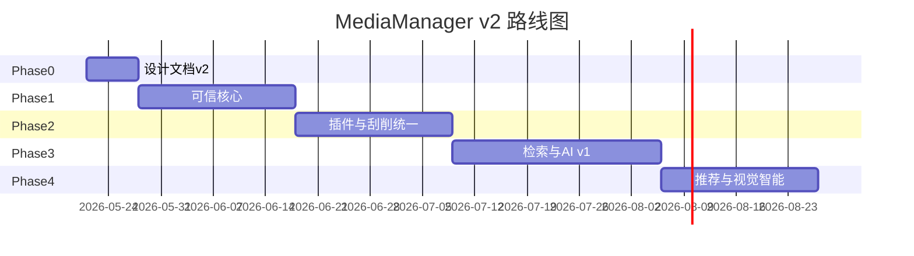

# MediaManager v2 — 愿景与路线图

> 本文档为 v2 设计体系入口。Legacy 设计见 `docs/01-architecture.md` ~ `docs/09-milestones.md`。

## 1. 产品定位

MediaManager 是自托管的**现代化媒体管理平台**，对标 Jellyfin / Plex 的影音体验、Stash 的编目与标签能力、Immich 的语义检索思路，并通过**可插拔混合 AI** 增强元数据治理与发现能力。

| 维度 | 定位 |
|------|------|
| 部署 | 单节点 Docker，SQLite + 本地缓存，无 Redis 依赖 |
| 用户 | 家庭用户 + 重度收藏者/管理员 |
| 原则 | 非侵入源文件；库级权限；设计先行、分阶段交付 |

## 2. 用户价值目标

1. **一站式媒体库**：视频 / 剧集 / 图片 / 音频统一管理。
2. **可信元数据**：NFO 优先 → 技术探测 → 在线刮削 → AI 补全（可审核）。
3. **找得到、播得了**：结构化筛选 + 全文 + 语义检索；HLS 兜底非原生格式。
4. **可治理**：刮削计划、任务队列、批量打标、回收站、系统日志。
5. **可扩展**：Extractor / Scraper / Classifier / AiProvider 插件化注册。

## 3. 业界能力对照

| 能力 | Jellyfin | Plex | Stash | Immich | MediaManager v2 |
|------|----------|------|-------|--------|-----------------|
| NFO / 本地元数据 | 强 | 中 | 弱 | — | 强（链式合并） |
| 插件生态 | Provider | Agent | 脚本 | ML 模型 | 统一 Plugin SPI |
| 点播 / 转码 | 强 | 强 | 弱 | — | Range + HLS + 可选档位 |
| 标签 / 规则编目 | 中 | 中 | 强 | 中 | 强 + AI 打标 |
| 语义检索 | — | — | 指纹 | CLIP | FTS + Embedding + NL |
| 推荐 | 弱 | 强 | 弱 | 相册 | 行为 + 向量 + AI 解释 |

## 4. 与 Legacy 的主要差异

| 项 | Legacy (`docs/01-09`) | v2 |
|----|----------------------|-----|
| AI | 分类器「预留」 | 一等公民：AiProvider、审核流、语义搜 |
| 插件 | 仅 Extractor 链 | 四类插件 + `library_plugin_config` |
| 刮削 | 混在管线文档 | 独立任务状态机 + 计划调度 |
| 检索 | 列表筛选 API | 结构化 + FTS5 + 向量 + NL |
| 里程碑 | 大量 `[x]` 超前 | v2/11 按真实验收标准维护 |
| 剧集 | 表结构有、产品弱 | 明确「完整季集 UI」或「扁平降级」决策点 |

## 5. 阶段路线图

| 阶段 | 目标 | 关键交付 |
|------|------|----------|
| **0** | 设计可评审 | `docs/v2/*`、`deployment.md` |
| **1** | 可信核心 | 库权限、HLS、手动匹配、回收站、access.ts、测试 |
| **2** | 插件化 | plugin 模块、配置迁移、刮削状态机 |
| **3** | 智能检索 | AiProvider、FTS、向量搜、审核 UI |
| **4** | 体验增强 | 推荐、以图搜图、剧集 UI（可选） |
| **5** | 生态 | 组件库、MusicBrainz、插件包格式（持续） |

## 6. 明确不做（v2 首期）

- 多节点集群、联邦同步
- 完整 DVR / 直播电视
- 非线性视频编辑（NLE）

## 7. 文档索引

| 文档 | 说明 |
|------|------|
| [01-architecture.md](./01-architecture.md) | 分层架构与模块 |
| [02-plugin-system.md](./02-plugin-system.md) | 插件 SPI |
| [03-metadata-and-scrape.md](./03-metadata-and-scrape.md) | 元数据与刮削 |
| [04-ai-platform.md](./04-ai-platform.md) | AI 平台 |
| [05-search-and-recommendation.md](./05-search-and-recommendation.md) | 检索与推荐 |
| [06-catalog-and-library.md](./06-catalog-and-library.md) | 目录与库 |
| [07-streaming.md](./07-streaming.md) | 点播 |
| [08-api-contract.md](./08-api-contract.md) | API 契约 |
| [09-frontend-ia.md](./09-frontend-ia.md) | 前端 IA |
| [10-database-evolution.md](./10-database-evolution.md) | 库表演进 |
| [11-implementation-plan.md](./11-implementation-plan.md) | 实现计划 |
| [appendix-gap-legacy.md](./appendix-gap-legacy.md) | Legacy 差距对照 |
