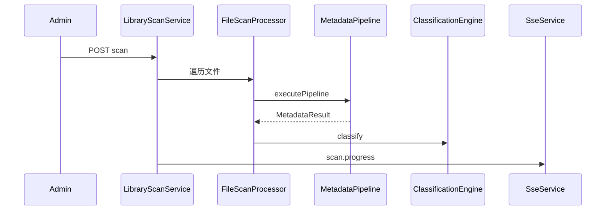

# MediaManager v2 — 总体架构

## 1. 逻辑分层

```
┌──────────────────── 表现层 ────────────────────┐
│  Web (Umi Max + Ant Design 5)                │
│  REST / SSE / 静态资源 (Spring Boot 内嵌)     │
└────────────────────┬───────────────────────────┘
                     │
┌────────────────────┴───────────────────────────┐
│  API 层：Controller + Security + Validation   │
└────────────────────┬───────────────────────────┘
                     │
┌────────────────────┴───────────────────────────┐
│  领域服务层                                    │
│  Library │ Catalog │ Metadata │ Classification │
│  Streaming │ Task │ Search │ Recommendation  │
│  AiOrchestrator │ Security (LibraryAccess)    │
└────────────────────┬───────────────────────────┘
                     │
┌────────────────────┴───────────────────────────┐
│  插件层 (SPI)                                  │
│  Extractor │ Scraper │ Classifier │ AiProvider │
└────────────────────┬───────────────────────────┘
                     │
┌────────────────────┴───────────────────────────┐
│  基础设施                                      │
│  SQLite │ Flyway │ Caffeine │ FFmpeg          │
│  FTS5 (可选) │ VectorIndex (可选) │ 文件缓存   │
└────────────────────────────────────────────────┘
```

## 2. 技术栈（保持演进）

| 层 | 技术 | 版本策略 |
|----|------|----------|
| 后端 | Spring Boot | 3.4.x，Java 21，Virtual Threads |
| 持久化 | SQLite + Flyway | 单文件 WAL；未来可迁 PostgreSQL |
| 安全 | Spring Security + JWT | Access 2h / Refresh 7d |
| 前端 | @umijs/max + Ant Design 5 | 暗色主题 |
| 构建 | Maven + npm | 多阶段 Docker |
| 文档 | SpringDoc OpenAPI | 与 08-api-contract 对齐 |

## 3. 后端模块映射

| v2 模块 | 包路径（目标） | 职责 |
|---------|----------------|------|
| library | `com.mediamanager.library` | 媒体库、路径、扫描 |
| catalog | `com.mediamanager.media` | 媒体项、文件、季集、回收站 |
| metadata | `com.mediamanager.metadata` | 管线、刮削任务/计划 |
| classification | `com.mediamanager.classification` | 标签、分类、规则引擎 |
| plugin | `com.mediamanager.plugin` | 插件注册与配置（Phase 2） |
| ai | `com.mediamanager.ai` | AiOrchestrator、Provider（Phase 3） |
| search | `com.mediamanager.search` | FTS、向量、NL 查询（Phase 3） |
| streaming | `com.mediamanager.streaming` | Range、HLS、缩略图 |
| sync | `com.mediamanager.sync` | WatchService、SSE |
| system | `com.mediamanager.system` | 用户、RBAC、配置、日志 |

## 4. 核心数据流

### 4.1 扫描入库



### 4.2 异步刮削（与管线分离）

- **扫描/刷新**：默认仅跑本地链（NFO、FFprobe、EXIF）。
- **在线刮削**：由 `ScrapeTask` / `ScrapeSchedule` 入队，调用 Scraper 插件。
- **AI 补全**：刮削成功后可选触发，结果写入 `ai_suggestion` 待审核。

### 4.3 播放请求

1. `LibraryAccessEnforcer` 校验文件所属库。
2. 判断 MIME / 容器：原生 → Range；否则 → HLS remux 缓存。
3. 前端 `VideoPlayer`（xgplayer）加载 m3u8 或直链。

## 5. 事件驱动

| 事件 | 生产者 | 消费者 |
|------|--------|--------|
| 文件创建/修改/删除 | DirectoryWatcher | 防抖 → 增量扫描 |
| 扫描进度 | LibraryScanService | SSE `scan.progress` |
| 刮削状态 | ScrapeTaskService | SSE `scrape.task` |
| 元数据完成 | MetadataOrchestrator | 分类引擎、FTS 索引 Job |
| 系统日志 | Logback Appender | SSE `system.log` |

## 6. 安全架构

### 6.1 RBAC

用户 → 角色 → 权限（`hasAuthority` 注解）。预置角色：SUPER_ADMIN、ADMIN、USER、GUEST。

### 6.2 库级权限（Phase 1 强制）

```
effectiveAccess(user, library) =
  if SUPER_ADMIN then ALLOW_ALL
  else if library_access row exists then row.permission
  else role.globalPermissions only
```

所有 `MediaItem` / `MediaLibrary` / `Stream` 查询必须经过 `allowedLibraryIds(userId)` 过滤。

### 6.3 路径安全

流式与图片服务禁止路径遍历；容器内 `path-map-from/to` 映射宿主机路径。

## 7. 部署架构

单容器（推荐）：

- 端口 80/8080：API + 前端静态资源
- 卷 `./data`：SQLite、`cache/`（HLS、缩略图、海报）
- 卷媒体目录：只读挂载，配合 `MEDIAMANAGER_STORAGE_PATH_MAP_*`

详见 [../deployment.md](../deployment.md)。

## 8. ADR 摘要

| ID | 决策 | 理由 |
|----|------|------|
| ADR-001 | 保留 SQLite 为默认存储 | 轻量化单节点；向量小规模 brute-force |
| ADR-002 | AI Provider 可插拔混合 | 隐私与成本可控 |
| ADR-003 | 刮削与扫描管线分离 | 避免扫描阻塞、便于重试与限流 |
| ADR-004 | OpenAPI 为 API 单一事实来源 | 前后端代码生成与契约测试 |
