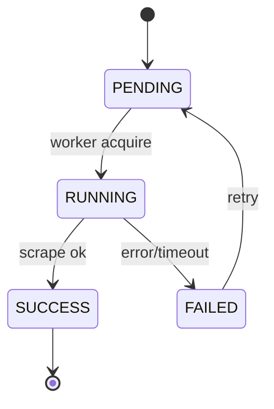

# MediaManager v2 — 元数据与刮削

## 1. 两条路径

| 路径 | 时机 | 插件类型 | 特点 |
|------|------|----------|------|
| **同步管线** | 扫描、单条 refresh | EXTRACTOR | 本地、快速、链式合并 |
| **异步刮削** | 计划/手动任务 | SCRAPER | 网络、可重试、可批量 |

```
扫描 ──► FileScanProcessor ──► MetadataPipeline (EXTRACTOR only)
                                    │
                                    ▼
                              ClassificationEngine

ScrapeSchedule ──► ScrapeTask ──► Scraper plugins ──► DB
                                        │
                                        ▼ (optional)
                                  AiOrchestrator.suggest
```

## 2. 同步管线

与 legacy `docs/03-metadata-pipeline.md` 一致，规则：

- 按 `library_plugin_config.priority` 排序（或过渡期 `library_extractor_config`）。
- `MetadataResult.mergeFrom`：不覆盖已有字段。
- 单 Extractor 失败继续下一个。

默认链（电影库）：`nfo` → `ffprobe` → `exif`（按类型过滤 supports）。

## 3. 异步刮削

### 3.1 实体

- `scrape_schedule`：cron、库范围、插件列表、enabled。
- `scrape_task`：单次执行单元，状态机如下。

### 3.2 状态机



| 状态 | 说明 |
|------|------|
| PENDING | 已创建待执行 |
| RUNNING | 正在调用 Scraper |
| SUCCESS | 元数据已持久化 |
| FAILED | 可重试，记录 error_message |
| CANCELLED | 用户取消（可选） |

### 3.3 与扫描的边界

- **禁止**：全库扫描中对每个文件同步调用 TMDb/JavBus（限流与性能）。
- **允许**：扫描后按库策略入队「未识别」项的 ScrapeTask。

## 4. 内置 Scraper

| plugin_id | 适用类型 | 匹配策略 |
|-----------|----------|----------|
| tmdb | MOVIE, TV_SHOW | NFO id → 搜索 API |
| javbus | MOVIE | 番号解析 |
| stashdb | MOVIE | Stash ID / 搜索 |

配置存于 `library_plugin_config.config` JSON。

## 5. 文件名解析

`FileNameParser` 供 Extractor/Scraper 共用：标题、年份、季集、番号等。

## 6. 海报与缩略图

1. Scraper 返回 URL → 下载至 `data/cache/images`。
2. 仍无海报 → `ThumbnailService` 从视频帧生成。
3. 图片库 → EXIF + 原图缩略图。

## 7. 手动识别

`POST /api/v1/items/{id}/identify`

```json
{ "provider": "tmdb", "externalId": "27205" }
```

权限：`media:edit_metadata`。绕过自动匹配，直接拉取详情写入。

## 8. SSE 事件

| 事件 | payload |
|------|---------|
| `scrape.task.updated` | taskId, status, progress, libraryId |
| `scan.progress` | libraryId, percent, processed |

## 9. 失败与重试

- 最大重试 3 次，指数退避。
- 全局并发：`mediamanager.scraper.max-concurrent`（默认 2）。
