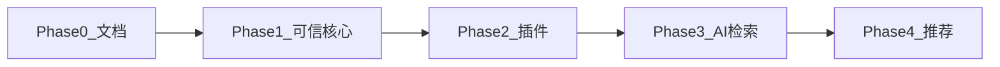

# MediaManager v2 — 实现计划

> 验收标准必须可在 CI 或手工检查清单中验证；禁止未实现功能标记完成。

## Phase 0 — 设计基线（当前）

| ID | 任务 | 状态 | 验收 |
|----|------|------|------|
| P0-1 | `docs/v2/00~11` 文档 | 进行中 | 文档评审通过 |
| P0-2 | `appendix-gap-legacy.md` | 待办 | 覆盖 legacy 9 篇 |
| P0-3 | `deployment.md` | 待办 | 可独立部署 |
| P0-4 | README 指向 v2 | 待办 | 链接有效 |

## Phase 1 — 可信核心（2–3 周）

### 后端

| ID | 任务 | 文件/模块 | 验收 |
|----|------|-----------|------|
| P1-1 | `LibraryAccessService` + `allowedLibraryIds` | `system/security` | 单元测试：USER 仅见授权库 |
| P1-2 | MediaItem/Library 查询过滤 | `MediaItemRepository`, `MediaItemService` | 集成测试跨库 403 |
| P1-3 | Stream 库权限校验 | `StreamService` | 未授权 fileId 404/403 |
| P1-4 | HLS remux 服务 | `HlsStreamingService`, `StreamController` | MKV 返回 m3u8 可播 |
| P1-5 | `POST /items/{id}/identify` | `MediaItemController`, TMDb search | 手动选定后元数据更新 |
| P1-6 | 回收站 API + 30 天清理 Job | `RecycleBinService`, migration | 软删文件可列出；超期物理清理记录 |
| P1-7 | 集成测试套件 | `src/test/java` | `mvn test` 绿 |

### 前端

| ID | 任务 | 验收 |
|----|------|------|
| P1-8 | `src/access.ts` + 路由 access | GUEST 无管理菜单 |
| P1-9 | `VideoPlayer` xgplayer + HLS | Player 页 MKV 可播 |
| P1-10 | 手动匹配弹窗 | Detail 页可选 TMDb 结果 |
| P1-11 | 回收站入口（可选简页） | 列表可见已删项 |

### Phase 1 里程碑验收

- [ ] 非 SUPER_ADMIN 无法访问未授权库媒体与流
- [ ] HLS 端点与设计 07-streaming 一致
- [ ] 手动 identify 可用
- [ ] `mvn test` 至少 5 个集成场景通过

## Phase 2 — 插件与刮削统一（2–3 周）

| ID | 任务 | 验收 |
|----|------|------|
| P2-1 | `plugin` 包 + `PluginRegistry` | 启动日志打印已注册插件 |
| P2-2 | Flyway `V14__library_plugin_config` + 数据迁移 | 旧 extractor 配置可读 |
| P2-3 | Scrape 状态机统一 | PENDING→RUNNING→SUCCESS/FAILED |
| P2-4 | 扫描不触发重量级 Scraper | 扫描仅 EXTRACTOR 链 |
| P2-5 | SSE `scrape.task` 事件 | 前端 Tasks 页可见 |
| P2-6 | Mock Extractor 插件示例 | 不改 Pipeline 核心类即可注册 |

## Phase 3 — 检索与 AI v1（3–4 周）

| ID | 任务 | 验收 |
|----|------|------|
| P3-1 | `AiProvider` SPI + Ollama + OpenAI-compatible | health 检查接口 |
| P3-2 | `ai_suggestion` 表 + 审核 API | 批准后写入 movie_metadata |
| P3-3 | FTS5 `media_fts` + 索引 Job | 关键词搜 title 命中 |
| P3-4 | `media_embedding` + embed Job | 语义搜返回相关 item |
| P3-5 | `POST /search/semantic`, `/search/query` | NL 查询可解析并返回 |
| P3-6 | `AiClassifier` | 建议进入审核队列 |
| P3-7 | 前端 `/search` + `/intelligence/review` | E2E 演示通过 |

## Phase 4 — 推荐与视觉（可选）

| ID | 任务 | 验收 |
|----|------|------|
| P4-1 | Discover 推荐 API | 基于历史+收藏 |
| P4-2 | 以图搜图 | 图片 item 相似排序 |
| P4-3 | 剧集季集 UI 或 ADR 扁平化 | 文档与实现一致 |

## 依赖关系

## 风险门禁

- Phase 3 启动条件：P1-1~P1-3 集成测试通过。
- 新增 Scraper 插件条件：P2-1 注册表可用。

## 工时粗估

| 阶段 | 后端 | 前端 | 合计 |
|------|------|------|------|
| P1 | ~40h | ~24h | ~64h |
| P2 | ~32h | ~16h | ~48h |
| P3 | ~48h | ~32h | ~80h |
| P4 | ~24h | ~24h | ~48h |
